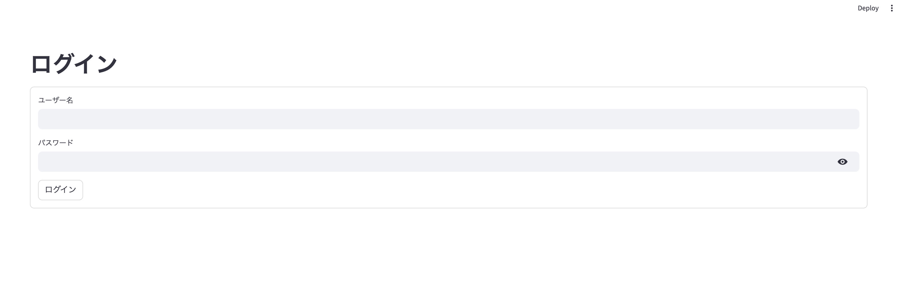
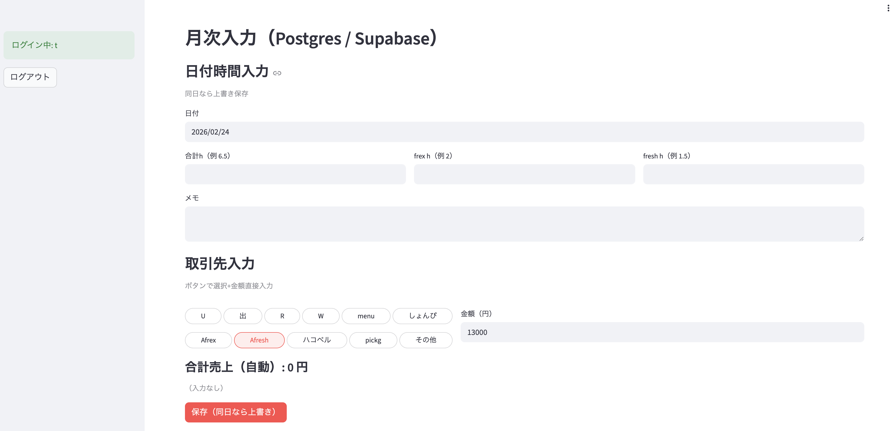
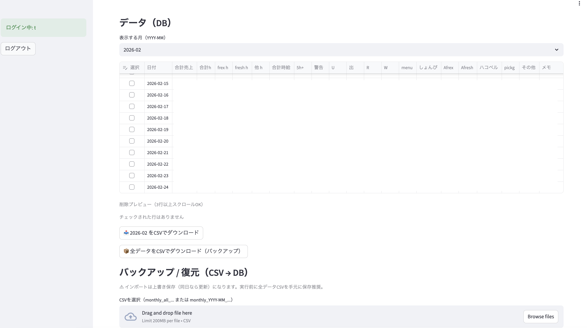
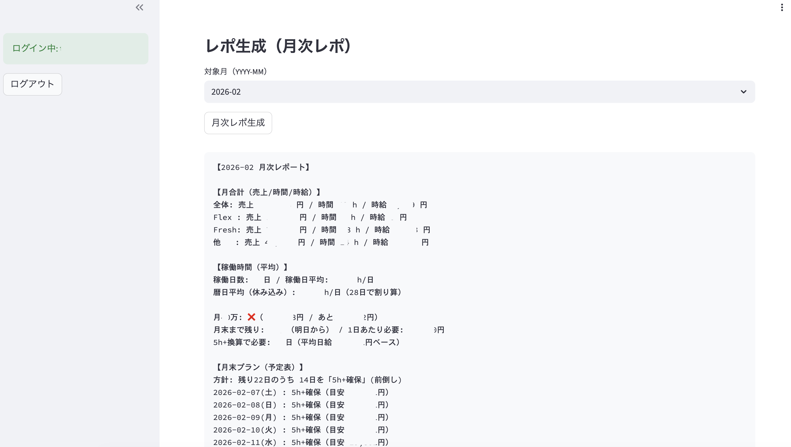

# streamlit-monthly-input

軽貨物ドライバー向け：売上と稼働時間を入力して、月次レポを自動表示する Streamlit アプリ。

## できること
- ログイン（APP_USERNAME / APP_PASSWORD）
- 日次入力 → 保存（同日なら上書き）
- 月切り替え表示
- CSVエクスポート（表示中の月 / 全データ）
- CSVインポート（復元）
- チェックした行を削除
- 月次レポ生成（売上/時間/時給 + 各種指標）

## Screenshots

### 1) ログイン


### 2) 日付・時間入力


### 3) データ一覧（DB）＋CSV


### 4) 月次レポ生成


## ローカル起動
```bash
cd ~/Desktop/python_practice
python3 -m venv .venv
source .venv/bin/activate
pip install -r requirements.txt

# ローカルはログイン無し（開発用）
DEV_NO_AUTH=1 streamlit run app.py
```

## Deploy（Railway）
- https://streamlit-monthly-input-production.up.railway.app/

## 環境変数（Railway Variables）
必須：
- SUPABASE_DB_URL
- APP_USERNAME
- APP_PASSWORD

任意（ローカル開発用）：
- DEV_NO_AUTH=1

## 構成（ざっくり）
Browser → Streamlit（Railway）→ Supabase Postgres

## バックアップ運用（おすすめ）
- 月1回「全データCSV」をダウンロードして保管
- 必要ならCSVインポートで復元

## 運用メモ（重要）
- 使わない時は Railway 側で Remove（停止）してクレジット消費を抑える
