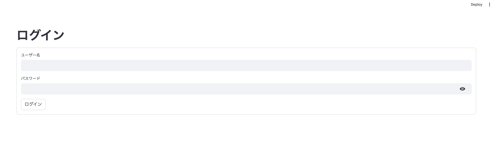
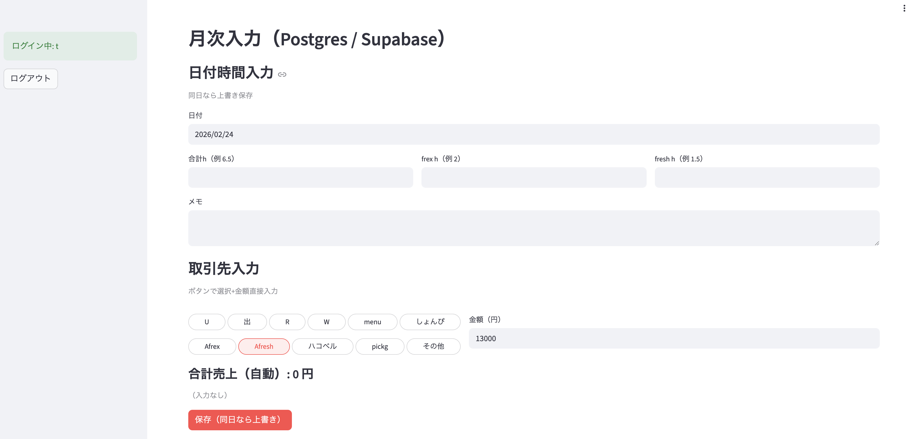
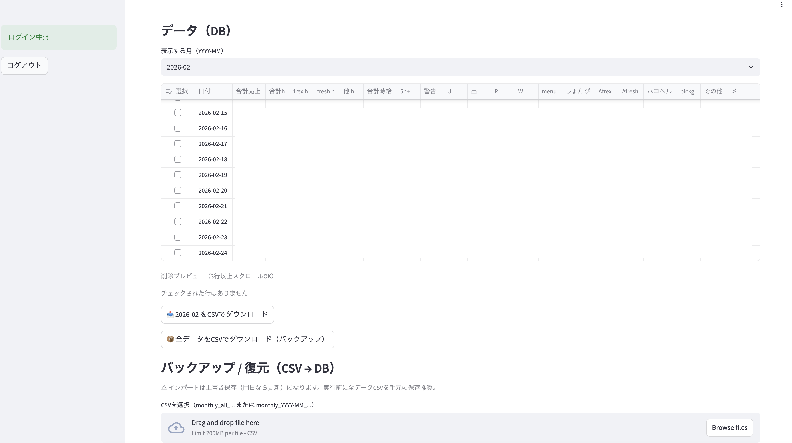
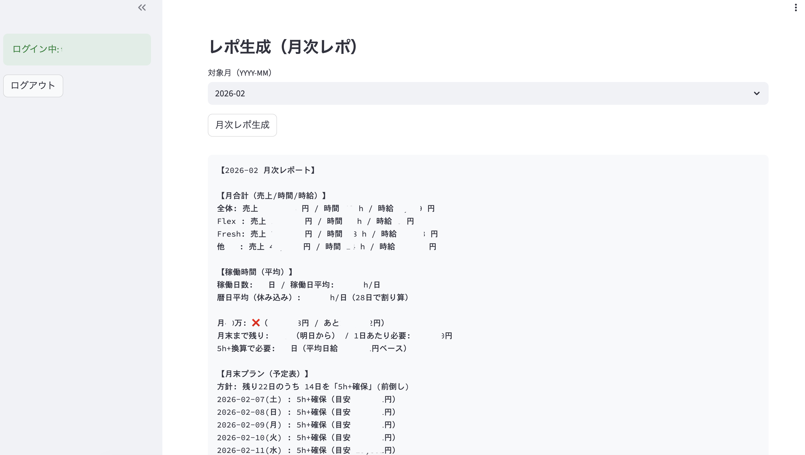

# 📊 streamlit-monthly-input（日次売上・月次レポアプリ）

> 🚛 軽貨物ドライバー向けに開発した、**実業務で毎日使用中**の業務支援アプリです。

日々の売上・稼働時間を入力するだけで、**月次レポートを自動生成**。  
データはクラウド（Supabase）に保存され、どこからでもアクセスできます。

---

## 😓 こんな課題を解決しました

- 日報がメモ帳やスプレッドシートに散らばり、**月末集計に時間がかかる**
- 手作業による転記ミス・集計ズレが発生していた
- 時給・目標達成率など「経営判断に使える指標」がすぐに見えない
- バックアップ手段がなく、データ消失リスクがあった

---

## 🚀 主な機能

- 🔐 ログイン認証（環境変数による簡易認証）
- 📝 日次入力・保存（同日上書き対応）
- 📅 月切り替え表示
- 📈 月次レポ自動生成
  - 売上 / 稼働時間 / 時給 / 各種指標
  - 月間目標進捗・残額・必要日給の自動算出
  - 日別 TOP / WORST 分析
- 💾 CSV バックアップ / 復元（全データ・月別）
- 🗑️ チェックした行を個別削除

---

## 🛠 技術構成

| 項目 | 内容 |
|------|------|
| 言語 / UI | Python 3.12 / Streamlit |
| DB | Supabase（PostgreSQL）|
| ホスティング | Streamlit Community Cloud（デプロイ済み）|
| 認証 | 独自簡易認証（環境変数管理）|
| データ処理 | pandas / psycopg2 |
| バージョン管理 | Git / GitHub |

---

## 📸 Screenshots

### 🔐 ログイン

### 📝 日次入力

### 📋 データ一覧

### 📈 月次レポ

---

## 🎯 一言アピール

「月末の集計作業をゼロにしたい」という自分自身の課題から生まれたアプリ。  
毎日の入力だけで **売上・時給・目標進捗がリアルタイムで可視化** され、  
軽貨物ドライバーとしての経営判断を数値ベースで行えるようになりました。  
**業務で毎日使い続けながら改善を重ねた、実践ベースのプロダクトです。**

---

## 👤 Author

たつのり（TEMC）  
軽貨物ドライバー / 個人開発  
🔗 [ここなら](https://coconala.com/users/5901606) ／ [クラウドワークス](https://crowdworks.jp/public/employees/4545609)

---

## 📄 License

This project is for personal and portfolio use.
